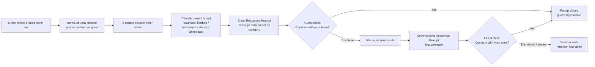

# Reconnect Prompt — User Flow

This renders automatically on GitHub (in this file or pasted into a PR description).

**Where each step lives in the code (once built):**
- A/B — existing `roomLinkData` check in `excalidraw-app/App.tsx`
- C/H — new timers in `excalidraw-app/components/ReconnectPrompt/ReconnectPrompt.tsx`
- D — `excalidraw-app/data/classifyBoard.ts` (local heuristic, no AI call)
- E/I — `excalidraw-app/data/reconnectPresets.ts` (curated copy per category)
